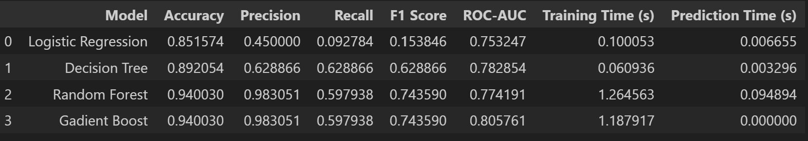
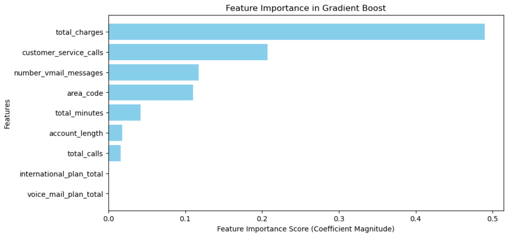

# Context
- Telecommunications firms keep a close eye on customer churn, which frequently stems from things like exorbitant prices, poor customer service, changing usage patterns, ineffective voicemail, or problems with area codes. Pricing is still important since consumers are drawn to more affordable plans with superior features though this will mean high retention costs and revenue loss.
- Are they able to predict if a customer will churn or not.

# Churn Distibution

![Churn Distribution]Churn Distribution.png
- The number of customers who have stayed 85.5% are more than the number of customers who have churned  14.5% hence showing some class imbalance. 

# Feature Engineering
- Feature engineering is the process of converting raw data into meaningful features in order to improve machine learning model performance. It entails adding, changing, or eliminating features using techniques such as aggregation, encoding, and scaling. This improves pattern identification, decreases noise, and optimizes model efficiency to make better predictions.
- The dataset was merged by combining redundant variables and summarizing relevant indicators.  Instead of having distinct binary columns for international and voicemail plans, they are combined into international_plan_total and voice_mail_plan_total, reducing dimensionality while maintaining data consistency.  Furthermore, call, minute, and charge statistics from various periods (day, evening, night, and international) are combined into total_calls, total_minutes, and total_charges to provide a more complete picture of overall usage trends.  This transformation increases model efficiency, decreases computational complexity, and improves interpretability while keeping critical customer features and churn indicators, resulting in better predictions.

# Using SMOTE to handle class imbalance

"""python
from imblearn.over_sampling import SMOTE
from collections import Counter

# Initialize SMOTE
smote = SMOTE(random_state=1)

# Apply SMOTE to the training data
x_train_resampled, y_train_resampled = smote.fit_resample(x_train, y_train)

# Print class distribution before and after
print("Before SMOTE:", Counter(y_train))  # Original class distribution
print("After SMOTE:", Counter(y_train_resampled)) 
""" 

## Classification Report 

### Best Model?
If you prioritize overall performance (Accuracy, F1, ROC-AUC): Random Forest

If you want the best churn separation (ROC-AUC): Gradient Boosting

If speed is a major factor: Decision Tree is a good trade-off.

If recall is crucial (capturing more churners): Logistic Regression, but it has lower precision.

# Confusion Matrix

### Which Model is Best?
If capturing the most churners is the priority: Logistic Regression (Highest TP, lowest FN).

If reducing false alarms (FP) is crucial: Random Forest or Gradient Boosting.

If a balance is needed: Gradient Boosting (Similar to Decision Tree but lower FP).

If accuracy in non-churners is more important: Random Forest (highest TN, lowest FP).

Random Forest or Gradient Boosting for a balanced approach.

## Histogram of probabilities for Model Confidence 

If the probabilities are skewed toward 0, the model is more confident that most customers will not churn.
If the probabilities are skewed toward 1, the model is more confident that most customers will churn.
If the probabilities are spread out, the model is more uncertain about predictions.
Model Confidence

A bimodal distribution (peaks near both 0 and 1) indicates that the model confidently separates churners from non-churners.
A normal or uniform distribution (spread across the middle) suggests that the model is uncertain in distinguishing churners from non-churners.
Comparing Models

If one model has probabilities mostly close to 0 and 1, it means it makes stronger classifications and is more confident.
If another model has probabilities concentrated around 0.5, it means it is less confident and struggles to differentiate churners from non-churners.

## Precision-Recall Curve 

- The overall balanced model is Random forest , Though Gradient Boosting seems to be the best with a recall of 0.62 and a precision of 0.59 though logistics regression seems to have High recall ensures you capture most of the actual churners. While the are under the curve is much larger for Gradient Boost and Random forest eith the beast threshold of 0.89 amd 0.74

# Feature Importance

- The top 3 Feature importance show very high correlation with churn
- Reccomendations
Billing issues drive churn → Provide flexible plans & loyalty discounts.
Support interactions predict dissatisfaction → Improve service resolution & proactive support.
Changing communication trends impact engagement → Adapt services to customer needs.

